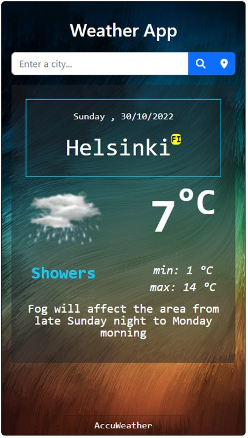
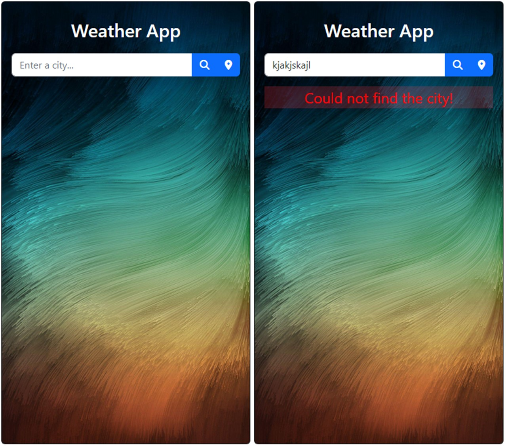
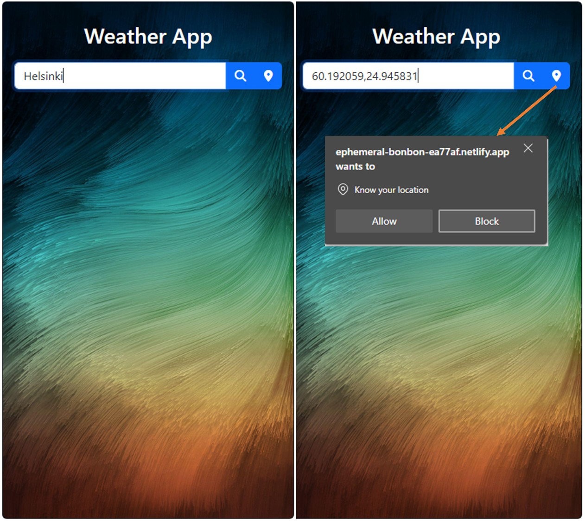

# simple-weather
A weather app created with ReactJs



## Setup
- Clone this repository
- Go to the app directory: `cd weather-app-v1 `
- Install all node_modules: `npm install`
- Add API key in `.env` file in `weather-app-v1` root (follow .envExample)
- Run the app using: `npm start`


## Dependencies:
```
npm install axios
npm install react-bootstrap bootstrap
npm install node-sass
```

using [font-awesome v6.2.0](https://cdnjs.com/libraries/font-awesome) in `public/index.html`

## Showcase:

